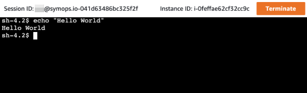
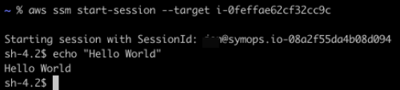
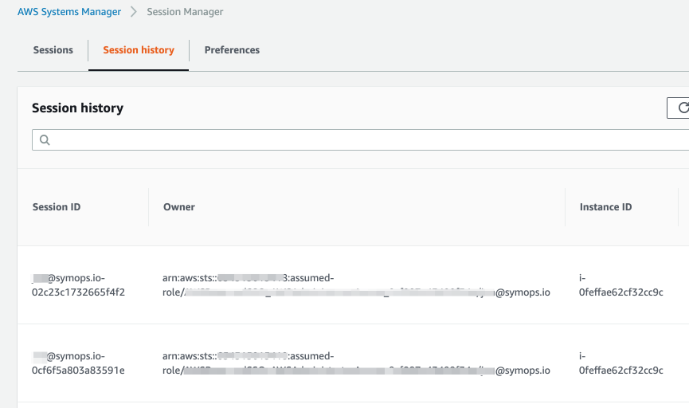
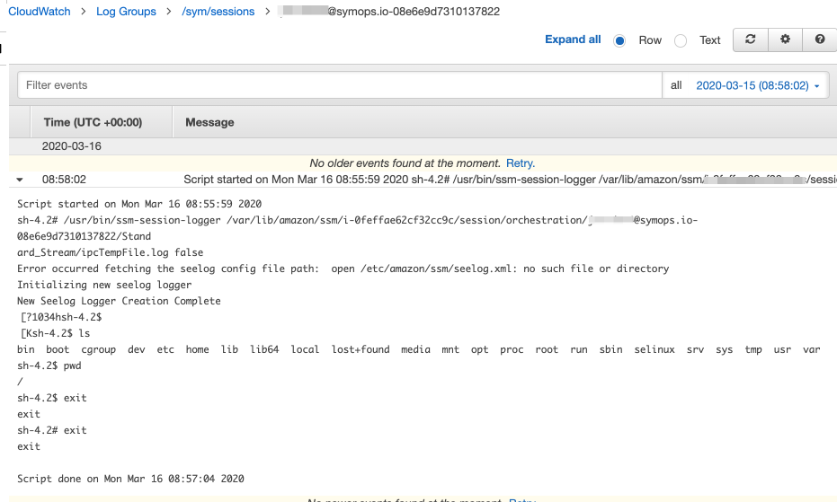

# AWS Session Manager: less infrastructure, more features

Hey I'm [Jon](https://www.jonbass.me/), CTO at Sym, and I've been building support for AWS Session Manager into our access management products. We're finding that many people still don't know about the features of Session Manager and how it can help them simplify their infrastructure, so I thought I'd share a bit of what we've learned.

## Less infrastructure

AWS Systems Manager [Session Manager](https://docs.aws.amazon.com/systems-manager/latest/userguide/session-manager.html) enables SSH access that is managed solely with IAM permissions. This approach has major benefits for infrastructure owners:

* No more bastion hosts required! Session Manager uses AWS APIs to communicate with your instances, so you can remove the administrative burden of maintaining bastion hosts.
* Fewer SSH ingress rules! Since your team is getting SSH access through Session Manager, you can remove ingress from your firewall and reduce your attack surface.

### Log in via the console or command line

You can use Session Manager to access instances via the AWS Console, or if you install the [AWS CLI Plugin](https://docs.aws.amazon.com/systems-manager/latest/userguide/session-manager-working-with-install-plugin.html), then you can also start sessions from your local workstation.

### Console access

### Command-line access

## More features

Beyond simplifying your infrastructure, Session Manager comes with a bunch of additional helpful features. I'll highlight two of those here.

### Managing access with tags

You can take advantage of conditional IAM policies to partition access to your instances in interesting ways. This statement, for example, only grants session access to instances that are tagged as part of the Analytics department:

    {
        "Effect": "Allow",
        "Action": "ssm:StartSession",
        "Resource": "arn:aws:ec2:*:*:instance/*",
        "Condition": {
            "StringLike": {
                "ssm:resourceTag/Department": "Analytics"
            }
        }
    }

### Logging your session activity

You can enable logging of what people are actually doing on instances when they SSH in. Logs can got to S3 or, if you've got CloudWatch logs set up on your instances, to CloudWatch logs.

In either case, each user's session gets logged with a Session ID that includes the user's name, such as `foo@example.com-0391fd059b5290de2`. From the Session ID you can get other metadata about the session, such as the EC2 instance, Start Time, and End Time:

You can dig in to the details of a session and see what commands someone ran like so:

## Required setup

The AWS Systems Manager Agent needs to be installed on your instances. The agent comes by default on Amazon Linux or can be installed on most other OSes.

You also need to ensure your instances have permission to talk to Session Manager. You can use the AWS-provided `AmazonSSMManagedInstanceCore` Managed Policy for this, or craft your own policy.

## Kicking the tires

If you want a quick way to try Session Manager out, the [terraform-okta-ssm-modules](https://github.com/symopsio/terraform-okta-ssm-modules) repo has examples to get you started.

## Further reading

Disney Streaming released [SSM Helpers](https://github.com/disneystreaming/ssm-helpers), which includes a command-line wrapper for SSH access with lots of extra features.

Hope you learned something! I'd love to learn how you're using Session Manager or what other features/integrations you'd like to see us explore. There are additional Session Manager features like port forwarding that I plan to write about soon. Please send me a Twitter DM ([@firstmorecoffee](https://twitter.com/firstmorecoffee)) or email ([jon@symops.io](mailto:jon@symops.io)) with your feedback.

## About Sym

Sym Access enables just-in-time access to your cloud infrastructure with workflows that developers will love and ops teams can rely on. Automate access and provide ops teams visibility and reports for easy audits.
